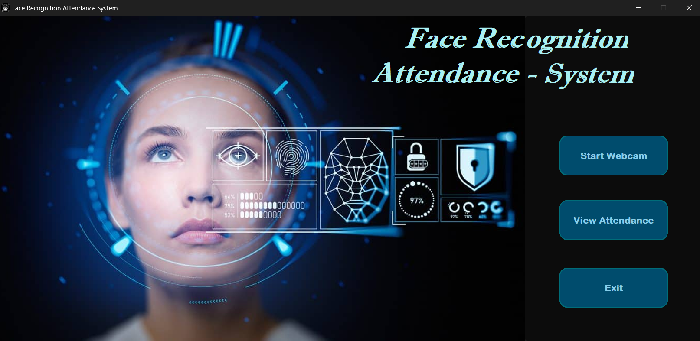

# Face Recognition Attendant System Tracker

## Overview

The **Face Recognition Attendant System Tracker** is an application designed to detect and track faces in real-time. It uses advanced face recognition algorithms to identify individuals and mark their attendance. This system is ideal for use in environments like classrooms, meetings, or workplaces where attendance tracking is automated through facial recognition.

## Features

- Real-time face detection and tracking using a webcam or video feed.
- Automatic attendance marking by recognizing faces.
- Easy integration with live webcam feeds.
- Efficient for small and large scale attendance management.

## Project Usage

The Face Recognition Attendant System Tracker uses **SQLite3**, Python's default database, to store and manage attendance records. SQLite3 is lightweight, built into Python, and requires no additional setup, making it ideal for this project.

#### Attendance Database
- The system stores attendance data (e.g., names, timestamps, and recognition status) in an SQLite database file (`attendance.sqlite`).
- This database can be easily queried to retrieve attendance logs for review or analysis.

#### How It Works
1. **Detection**: The system detects a face using the webcam feed.
2. **Recognition**: Matches the detected face against the trained dataset.
3. **Attendance Marking**: If a match is found, the individual's name and the timestamp are recorded in the SQLite database.


## Installation

1. **Clone the repository to your local machine**:
   ```bash
   git clone https://github.com/Kheav-Kienghok/Face_Recognition_Attendant.git

   cd Face_Recognition_Attendant

2. **Install required dependencies**:
    ```bash
    pip install -r requirements.txt

3. **Set Up the Webcam or Video Feed**:
   - Ensure that you have a webcam connected to your computer. The system will use the webcam for real-time face detection.

4. **Run the GUI**:
   The `gui.py` file is responsible for launching the graphical user interface. To start the system, run:
   ```bash
   python gui.py

## GUI Main Page

Here is an image of the main page of the Face Recognition Attendant System:



## Troubleshooting

### 1. Webcam Not Detected
If the webcam is not detected:
- **Check your webcam connection**: Ensure your webcam is properly connected to the computer.
- **Verify camera drivers**: Update or reinstall webcam drivers.
- **Test OpenCV**: Run a simple OpenCV webcam capture script:
   ```bash
   import cv2
   cap = cv2.VideoCapture(0)
   while True:
      ret, frame = cap.read()
      cv2.imshow('Webcam', frame)
      if cv2.waitKey(1) & 0xFF == ord('q'):
         break
   cap.release()
   cv2.destroyAllWindows()
- If this works, the webcam setup is correct.

### 2. Face Recognition Issues
If the system is not correctly detecting or recognizing faces:
- **Lighting**: Use a well-lit environment for better accuracy.
- **Camera positioning**: Ensure the camera is at a proper angle and distance.
- **Quality of Training Images**: If using a pre-trained model, ensure that the images used for training are clear and have proper face orientation. Low-quality or blurry images can impact recognition accuracy.

## Acknowledgment

This project was developed with inspiration and guidance from online resources, including [this guide on custom face recognition in Python](https://medium.com/@itsuki.enjoy/custom-face-recognition-in-python-62e7414d39cc). 

Special thanks to the contributors and the community for providing valuable insights and tools for building the Face Recognition Attendant System Tracker.